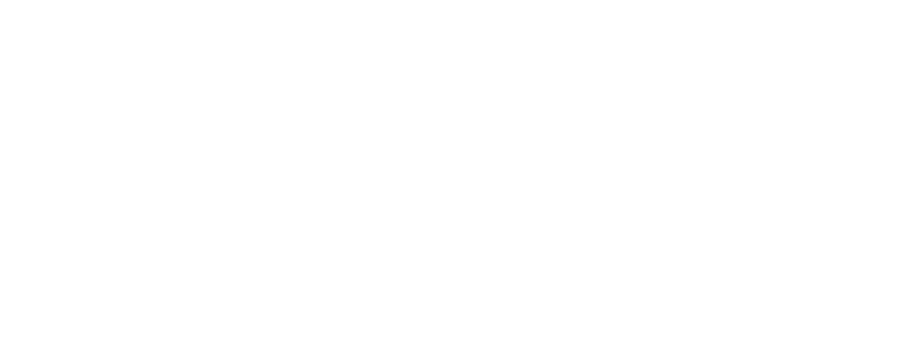
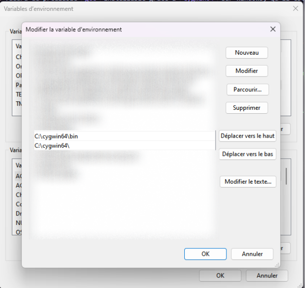

# Code Groupe en C

Ici seront ajouté tous les codes avec Wail Ait Hamedate, Daniel Alves Araujo, Antony 'Kiwi' et Lucas Espinar.
Ce groupe a été créé dans le but de pouvoir partager le code normalement ce qui sera bien pour les groupe plus tard en projet.

## Licence

Le projet est sous licence GNU Général Public Licence

## C'est quoi ici ?

C'est un endroit pour partager les projets en C et parfois en Ocaml pourquoi pas. N'hésitez pas à regarder comment faire pour Git un projet en local/Git.

# Programmation en C - Cours L2 Informatique

Nous mettons en pratique au maximum les cours et les testons dans plusieurs situations simples.
`main.c` est le fichier qui sera à la source de l'executable. Les autres fichiers seront disposé dans le dossier sources, header comme fichiers sources 

Pour pouvoir executer ce projet, il vous faudra au préalable `gcc` installable grâce à `cygwin64` sur Windows, qu'il est possible d'avoir depuis https://www.cygwin.com/ . `gcc` est nativement disponible sur les distributions GNU/Linux.

- Pour Windows

Il y a une petite spécificité sur Windows qu'il faut faire avant de poursuivre le projet : Ajouter `gcc` à la variable `Path`.
Après installation de Cygwin64, rechercher `Modifier les variables d'environnement système`


Paramètres Système Avancés -> Variables d'environnement


Puis double cliquer sur Path


Et enfin en cliquant sur une nouvelle ligne, insérer le lien vers le dossier de `cygwin64` et `cygwin64\bin`



Faites triplement `Ok` et redémarrez les programmes utilisant le path pour fonctionner si vous avez besoin d'accéder à `gcc` avec ceux-ci comme le Terminal ou encore Visual Studio Code dans notre cas. Redémarrez votre Ordinateur si Path n'est pas encore chargé, dans le pire des cas.

- Pour Linux

Naturellement disponible.

- Pour Mac

Malheureusement je n'en sais pas plus sur ce sujet à propos de Mac.

## Typedef créés

Dans ce projet, vous trouverez souvent des types non-objets listé comme ce qui suit en-dessous. Tous disponible dans le dossier sources. Sachez que pour les type `T_pile` et `T_file`, ils auront besoin au préalable de la structure `cellule`.

### Pile

`cellule`
```c
struct cellule
{
    int elem;
    struct cellule *suiv;
};
```

`T_pile`
```c
typedef struct cellule *T_pile;
```

Avec ses fonctions

```c
T_pile creerVide(void);
T_pile empiler(T_pile p, int val);
T_pile depiler(T_pile p);
void afficherPile(T_pile p);
int lenPile(T_pile p);
```
### File

`T_file`
```c
typedef struct {
    struct cellule *tete;
    struct cellule *queue;
}T_file;
```

Avec ses fonctions 

```c
T_file creerFile(void);
T_file enfiler(T_file file, int elem);
T_file defiler(T_file file);
```

### Array

Afin de comprendre Malloc, nous avons fait une fonction simplifiée qui n'appelle pas les pointeur au début mais qui doit être pointer tout du long sous la force de tableau `Array`.

```c
struct array
{
    int *elem;
    int size;
};

typedef struct array Array;
```

Avec ses fonctions

```c
Array empty_Array();
void append_int_array(Array *a, int e);
void afficher_array(Array a);
void free_array(Array *a);
```

### Arbres Binaires

Pour conclure et compléter les cours appris au Semestre 3 en Algorithme et Programmation, nous avons rajouté les arbres binaires limité à 25 de profondeurs avec le type `T_btree`.
```c
struct tree
{
    int elem;
    struct tree *subleft;
    struct tree *subright;
};

typedef struct tree *T_btree;
```

Avec ses fonctions

```c
T_btree creer_arbre_vide();
T_btree creer_arbre(int val);
T_btree creer_arbre_test(int profondeur);
T_btree subleft(T_btree tree);
void afficher_arbre(T_btree tree);
int free_branch(T_btree tree);
void free_tree(T_btree tree);
void cut(T_btree tree, char l_or_r);
unsigned long long get_nbr_leaf(T_btree tree);
unsigned long long get_nbr_noeuds(T_btree tree);
bool isleaf(T_btree tree);
int test_tree();
```

## Travaux Pratiques

Sachez qu'en parallèle, nous travaillons en groupe, et que nos fonctions créées à partir des exercices demandés sont aussi présent sous la forme des TP.

### TP1

```c
//Premières commandes
int quisuisje(void);
int permute(void);
int year(void);
int division(void);

// Structures de controles
int multi_aux(int a, int b);
int multi(void);
int pyramide(void);
int factoriel(void);
int sum(void);
int longue_cons(void);
int nombre_parfait(void);
int fibonacci(void);

//tableaux
int tableau(void);
int tableau_paire(void);
int random(void);
int randint(int min, int max);
int time_time(void);
int *tab_rand(void);
int *tab_rand_without_print(void);
int *tab_rand_without_print_limited(int limite);
int *tab_rand_without_print_double_limited(int limite_int, int limite_elem);
float moyenne_tab(void);
int *sep_pos_neg(void);
int power(int a, int b);
int int_to_bin(int nbr);
void print_tab(int *tab);
void print_tab_with_size(int *tab, size_t size);
void print_tab_bin_loop(int limite, int milliseconds);
void tri_tab(int *tab, size_t size);

//chaînes de caractères
void stringcmp(void);
void stringcopy(void);
char *stringcatenation(void);
void str_print(char *str);
void printc(void);
void triangle_word(char *mot, int nbr);
char *str_upside_down(char *str);
int palindrome(char *str);
```

### TP2

```c
void inversions(int *tab, size_t size);

//Fonctions
void ligne(int nbr);
float moyenne_3(int a, int b, int c);
int racine_polynome(int a, int b, int c);
void etudiant_matiere(int **tab, size_t n, size_t m);
int **tab_rand_double_dimensions(int number_max, int limite_elem_d1, int limite_elem_d2);
int **notetest(int nbr_eleve, int nbr_matiere);
void print_tab_double_dimension(int **tab, size_t d1, size_t d2);
void test_ultime_moyenne_etudiants();
void print_tab_with_size_float(float *tab, size_t size);
int *meilleureNoteMatiere(int **tab, size_t n, size_t m);
float *moyenneGeneraleEleve(int **tab, size_t n, size_t m);
float *moyenneGeneraleMatiere(int **tab, size_t n, size_t m);
float moyenne(int a, int b);
int facto(int n);
void facto_afficheur();
int fibonacci_tp2(int u0, int u1, int n);
void fibonacci_tp2_afficheur();
```

### TP3

Le TP3 vient tout juste de débuter, il n'y a aucune réelle fonction pour l'instant

```c
typedef struct date Date;
void afficheDate(Date D);
```