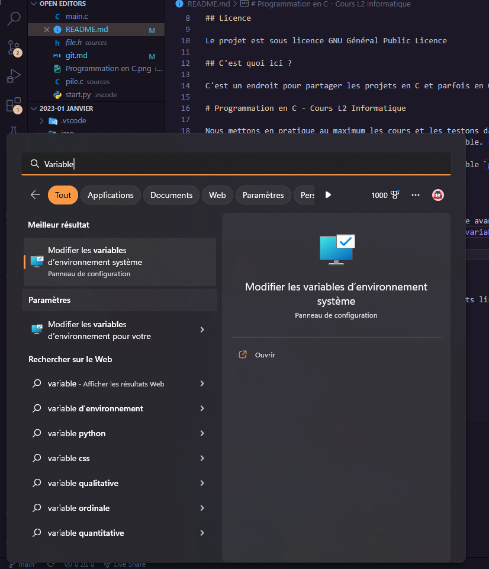
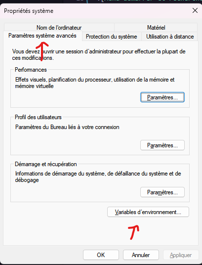
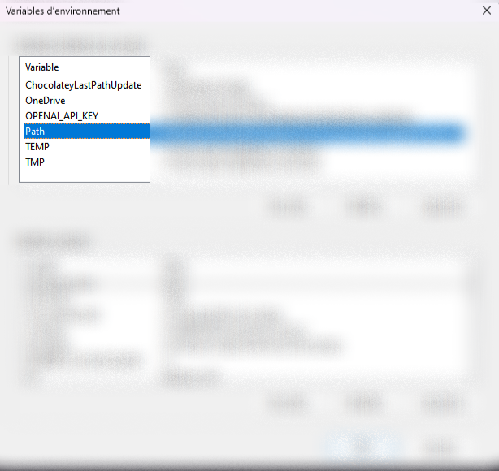

# Code Groupe en C

Ici seront ajouté tous les codes avec Hugo Allano, Wail Aithame Date, Daniel Alves Araujo, Antony et Lucas Espinar.
Ce groupe a été créé dans le but de pouvoir partager le code normalement ce qui sera bien pour les groupe plus tard en projet.

## Licence

Le projet est sous licence GNU Général Public Licence

## C'est quoi ici ?

C'est un endroit pour partager les projets en C et parfois en Ocaml pourquoi pas. N'hésitez pas à regarder comment faire pour Git un projet en local/Git.

# Programmation en C - Cours L2 Informatique

Nous mettons en pratique au maximum les cours et les testons dans plusieurs situations simples.
`main.c` est le fichier qui sera à la source de l'executable. Les autres fichiers seront disposé dans le dossier sources, header comme fichiers sources 

Pour pouvoir executer ce projet, il vous faudra au préalable `gcc` installable grâce à `cygwin64` sur Windows, qu'il est possible d'avoir depuis https://www.cygwin.com/ . `gcc` est nativement disponible sur les distributions GNU/Linux.

- Pour Windows

Il y a une petite spécificité sur Windows qu'il faut faire avant de poursuivre le projet : Ajouter `gcc` à la variable `Path`.
Après installation de Cygwin64, rechercher `Modifier les variables d'environnement système`



Paramètres Système Avancés -> Variables d'environnement



Puis double cliquer sur Path



Et enfin en cliquant sur une nouvelle ligne, insérer le lien vers le dossier de `cygwin64` et `cygwin64\bin`


## Typedef créé

Dans ce projet, vous trouverez souvent des types non-objets listé comme ce qui suit en-dessous. Tous disponible dans le dossier sources. Sachez que pour les type `T_pile` et `T_file`, ils auront besoin au préalable de la structure `cellule`.

`cellule`
```c
struct cellule
{
    int elem;
    struct cellule *suiv;
};
```

`T_pile`
```c
typedef struct cellule *T_pile;
```

Avec ses fonctions

```c
T_pile creerVide(void);
T_pile empiler(T_pile p, int val);
T_pile depiler(T_pile p);
void afficherPile(T_pile p);
int lenPile(T_pile p);
```

`T_file`
```c
typedef struct {
    struct cellule *tete;
    struct cellule *queue;
}T_file;
```

Avec ses fonctions 

```c
T_file creerFile(void);
T_file enfiler(T_file file, int elem);
T_file defiler(T_file file);
```

# Logs

## 13-01-2023

    - Création d'une excecution automatique pour tout le projet sous pyton pour Visual Studio Code.
    - Rendu de ce Repository public pour un meilleur partage mais seulement les membres-contributeurs peuvent intéragir directement avec les fichiers.
    - Impossible de régler le problème du dépilage des files.

## 12-01-2023

    - Ajout d'une programmation modulaire au "projet" de base.

## 11-01-2023

    - Support Git ajouté
    - Création du projet d'apprentissage du C pour L2 Infos. Ajout des structs T_pile, T_file et de leur fonction de modification